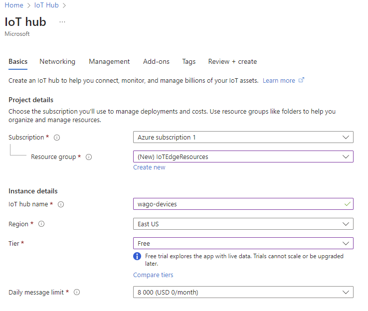

# Setup

## Wago IOT agent

[https://github.com/WAGO/azure-iot-edge](https://github.com/WAGO/azure-iot-edge)

### Create an IOT hub

First we need to setup an Azure CLI e.g. the [cloud shell](http://127.0.0.1:5000/o/7bZwYnIALlIEM4J6H1cL/s/YRovJybeVPYdm7pRo2It/), then we can create the hub:

#### Cloud shell


#### Web portal

<figure><figcaption></figcaption></figure>

This failed with:

```
{
  "code": "DeploymentFailed",
  "target": "/subscriptions/c061e993-6e38-4b98-858c-f0d71f8ad6f2/resourceGroups/IoTEdgeResources/providers/Microsoft.Resources/deployments/wago-devices-111714243",
  "message": "At least one resource deployment operation failed. Please list deployment operations for details. Please see https://aka.ms/arm-deployment-operations for usage details.",
  "details": [
    {
      "code": "ResourceDeploymentFailure",
      "target": "/subscriptions/c061e993-6e38-4b98-858c-f0d71f8ad6f2/resourceGroups/IoTEdgeResources/providers/Microsoft.Devices/IotHubs/wago-devices",
      "message": "The resource write operation failed to complete successfully, because it reached terminal provisioning state 'Failed'."
    }
  ]
}
```

###


### Register an IoT edge device


###
