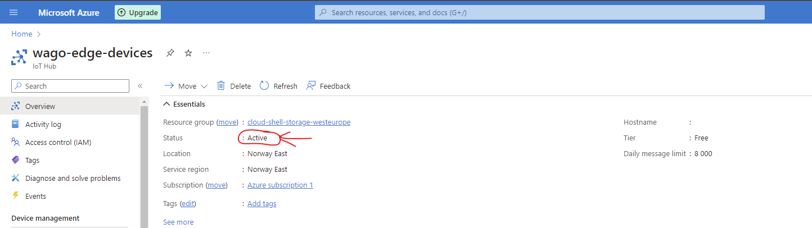

# Setup

## Issues

<mark style="color:red;">Check with Wago if we can use Wago Azure domain and free tier to create IoT hub.</mark>

<mark style="color:red;">Read below.</mark>

### <mark style="color:red;">Posted here!!</mark>

[<mark style="color:red;">https://learn.microsoft.com/en-us/answers/questions/1428798/error-in-creating-iot-hub-free-tier?page=1\&orderby=Helpful\&comment=answer-1363608#newest-answer-comment</mark>](https://learn.microsoft.com/en-us/answers/questions/1428798/error-in-creating-iot-hub-free-tier?page=1\&orderby=Helpful\&comment=answer-1363608#newest-answer-comment)

## Wago IOT agent

[https://github.com/WAGO/azure-iot-edge](https://github.com/WAGO/azure-iot-edge)

### Create an IOT hub

First we need to setup an Azure CLI e.g. the [cloud shell](http://127.0.0.1:5000/o/7bZwYnIALlIEM4J6H1cL/s/YRovJybeVPYdm7pRo2It/), then we can create the hub:

#### Cloud shell

<mark style="color:red;">**Not tested yet..**</mark>

```
// Something like..
az iot hub create --resource-group IoTWagoResource --name wago-edge-devices --sku F1 --partition-count 2
```

#### Web portal

Test 1:

<figure><figcaption></figcaption></figure>

This failed with:

```
{
  "code": "DeploymentFailed",
  "target": "/subscriptions/c061e993-6e38-4b98-858c-f0d71f8ad6f2/resourceGroups/IoTEdgeResources/providers/Microsoft.Resources/deployments/wago-devices-111714243",
  "message": "At least one resource deployment operation failed. Please list deployment operations for details. Please see https://aka.ms/arm-deployment-operations for usage details.",
  "details": [
    {
      "code": "ResourceDeploymentFailure",
      "target": "/subscriptions/c061e993-6e38-4b98-858c-f0d71f8ad6f2/resourceGroups/IoTEdgeResources/providers/Microsoft.Devices/IotHubs/wago-devices",
      "message": "The resource write operation failed to complete successfully, because it reached terminal provisioning state 'Failed'."
    }
  ]
}
```

test 2:

<figure><figcaption></figcaption></figure>

This failed with:

_Deployment to resource group 'cloud-shell-storage-westeurope' failed. Additional details from the underlying API that might be helpful: At least one resource deployment operation failed. Please list deployment operations for details. Please see https://aka.ms/arm-deployment-operations for usage details._

<mark style="color:red;">Tried to move the resource to another new one but it also failed. Strange is now that after this failed the previous resource is set to "active" but also get an error...</mark>

<figure><figcaption></figcaption></figure>

<figure><figcaption></figcaption></figure>

Private account test:

Same procedure as above.

<mark style="color:red;">Error: "EventHub Namespace Network Rule Sets Operations are not allowed on FreeHubs".</mark>

```json
{
    "status": "Failed",
    "error": {
        "code": "IotHubActivationFailed",
        "message": "An internal error occurred while activating IotHub",
        "details": [
            {
                "code": "IotHubActivationFailed",
                "message": "EventHub Namespace Network Rule Sets Operations are not allowed on FreeHubs"
            }
        ]
    }
}
```


### Register an IoT edge device


###
